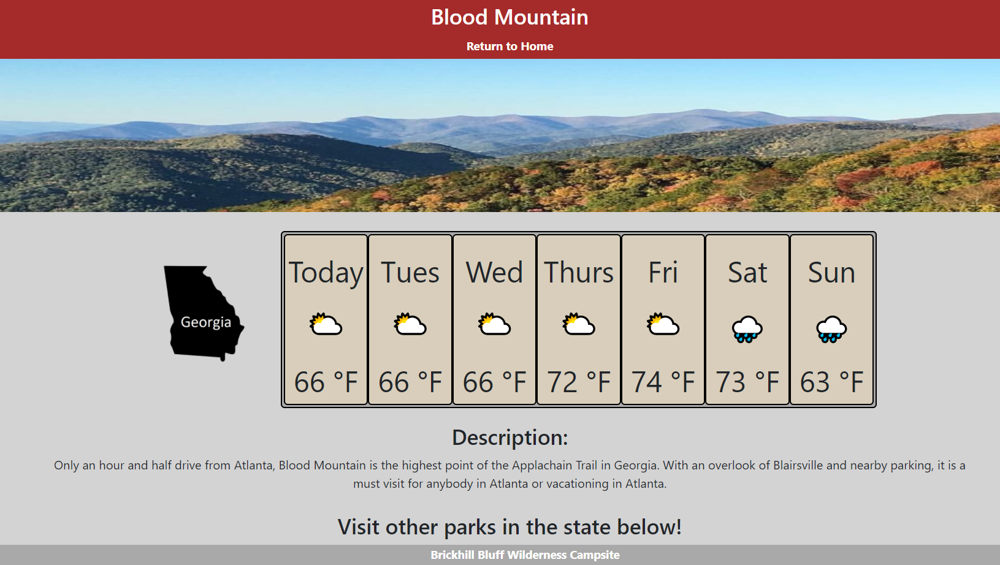

# Camping-in-the-SouthEast
Use this site to view great campsites in South East USA

### Website Features:
1) A dropdown menu with seven states in the South-East United States along with their best camping location chosen by our expert
2) A separate page for each state's campsite along with the distance to the site and the weather for the week
3) A descirption and picture of each campground along with a link to the official campground site for more information and booking
4) A "previously searched" link that will bring you back to the last state and campsite you visited

### What we learned from the creation of this site:
* How to better use GitHub's collaboration tools ie: managing branches
* Use of Google Map's API
* Better understanding of weather API
* Alternative styling method to bootstrap ie: Bulma
* Better understanding of JS dynamic styling methods

Look for camping near you at [our camping website!](https://vincentmomot.github.io/Camping-in-the-SouthEast)

Screenshots of the site:

